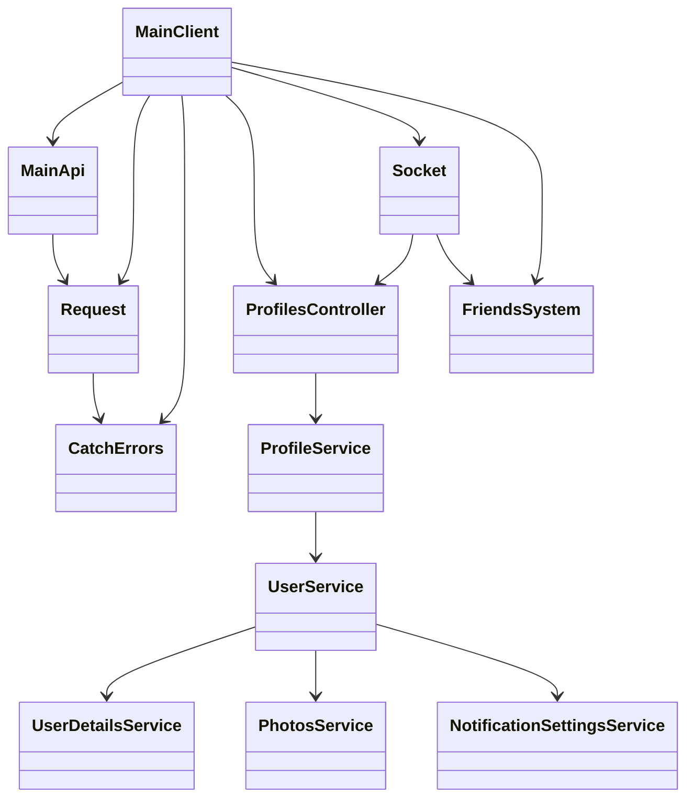
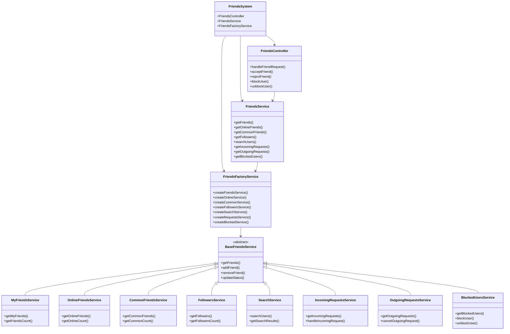
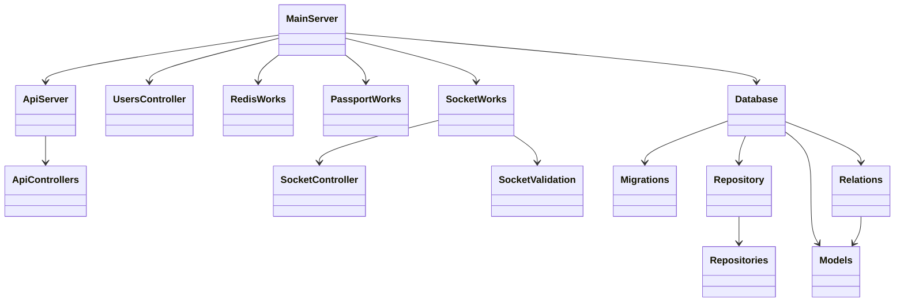

# My Messenger

Современный мессенджер с расширенными возможностями для общения и управления профилем.

## Технологический стек

### Frontend
- React + TypeScript
- Vite как сборщик
- Socket.IO для real-time коммуникации
- Zod для валидации событий сокет-соединения
- Axios для HTTP запросов
- Zustand для управления состоянием
- Material-UI для компонентов интерфейса
- React-testing-library, Jest + Vitest для тестирования
- Storybook для документации компонентов

### Backend
- Node.js + TypeScript
- Express.js как веб-фреймворк
- Sequelize ORM для работы с базой данных
- MS SQL Server как основная база данных
- Redis для кэширования и сессий
- Socket.IO для real-time функционала
- Zod для валидации событий сокет-соединения
- Multer для загрузки файлов
- Sharp для обработки изображений
- Winston для логирования

## Основные функции

### Профили пользователей
- Регистрация и авторизация
- Управление профилем
- Дополнительная информация о пользователе
- Настройки профиля
- Загрузка и управление фотографиями
- Просмотр профилей других пользователей
  - Просмотр фотографий
  - Просмотр списка друзей
  - Просмотр информации профиля

### Мессенджер
- Real-time обмен сообщениями
- Статусы сообщений (отправлено, доставлено, прочитано)
- Загрузка медиафайлов
- Групповые чаты
- Поиск по сообщениям и контактам

### Фоновые задачи
В приложении реализованы две фоновые задачи, которые работают в отдельном воркере и дочернем потоке Node.js:

1. Удаление неиспользуемых файлов
   - Запускается по расписанию (настраивается через `DELETE_UNUSED_FILES_JOB_SCHEDULE`)
   - Очищает неиспользуемые файлы из хранилища
   - Проверяет связи файлов с сообщениями и профилями
   - Удаляет файлы, не связанные с активными записями

2. Резервное копирование базы данных
   - Запускается по расписанию (настраивается через `BACKUP_JOB_SCHEDULE`)
   - Создает резервные копии базы данных
   - Управляет количеством хранимых копий
   - Проверяет целостность бэкапов

## Архитектура приложения

### Иерархия классов

#### Архитектура Frontend


#### Архитектура Friends System


#### Архитектура Backend


### Описание основных компонентов

#### Frontend
- `MainClient` - Ядро бизнес-логики клиента, инициализирует и координирует работу всех компонентов
  - `MainApi` - HTTP клиент для работы с API, обрабатывает все запросы к серверу
  - `Request` - Базовый класс для HTTP запросов, обеспечивает единый интерфейс для работы с сетью
  - `ProfilesController` - Контроллер профилей пользователей, управляет данными профиля
    - `ProfileService` - Сервис для работы с основными данными профиля
      - `UserService` - Сервис для работы с данными пользователя
        - `UserDetailsService` - Сервис для работы с дополнительной информацией пользователя
        - `PhotosService` - Сервис для работы с фотографиями
        - `NotificationSettingsService` - Сервис для работы с настройками уведомлений
  - `Socket` - WebSocket клиент, обеспечивает real-time коммуникацию
  - `CatchErrors` - Централизованная обработка ошибок, обеспечивает единый механизм обработки ошибок

#### Friends System
- `FriendsSystem` - Основной модуль системы друзей, объединяющий все компоненты для работы с друзьями
  - `FriendsController` - Контроллер для управления друзьями
    - Обработка заявок в друзья
    - Принятие/отклонение заявок
    - Блокировка/разблокировка пользователей
  - `FriendsService` - Основной сервис для работы с друзьями
    - Получение списка друзей
    - Управление онлайн-статусами
    - Поиск общих друзей
    - Работа с подписчиками
    - Поиск пользователей
    - Управление заявками
    - Работа с заблокированными пользователями
  - `FriendsFactoryService` - Фабрика для создания специализированных сервисов
    - Создание сервисов для различных аспектов работы с друзьями
    - Управление жизненным циклом сервисов
  - `BaseFriendsService` - Базовый абстрактный класс для всех сервисов друзей
    - Общие методы для работы с друзьями
    - Базовая функциональность для всех сервисов
    - `MyFriendsService` - Сервис для работы со списком друзей текущего пользователя
      - Получение списка друзей
      - Подсчет количества друзей
    - `OnlineFriendsService` - Сервис для работы со списком онлайн друзей
      - Отслеживание онлайн-статусов
      - Получение списка онлайн друзей
    - `CommonFriendsService` - Сервис для работы со списком общих друзей
      - Поиск общих друзей между пользователями
      - Подсчет общих друзей
    - `FollowersService` - Сервис для работы со списком подписчиков
      - Управление подписчиками
      - Подсчет подписчиков
    - `SearchService` - Сервис для поиска пользователей
      - Поиск по имени и другим параметрам
      - Фильтрация результатов
    - `IncomingRequestsService` - Сервис для работы с входящими заявками
      - Управление входящими заявками
      - Обработка новых заявок
    - `OutgoingRequestsService` - Сервис для работы с исходящими заявками
      - Управление отправленными заявками
      - Отмена заявок
    - `BlockedUsersService` - Сервис для работы со списком заблокированных
      - Управление заблокированными пользователями
      - Блокировка/разблокировка

#### Backend
- `MainServer` - Ядро бизнес-логики сервера, инициализирует и координирует работу всех компонентов
  - `ApiServer` - API роуты и middleware, обрабатывает HTTP запросы
    - `ApiControllers` - Контроллеры API endpoints (Users, Profiles, Photos, Messages)
  - `UsersController` - Контроллер пользователей, управляет данными пользователей
  - `Database` - Работа с базой данных, обеспечивает доступ к данным
    - `Migrations` - Управление миграциями базы данных
    - `Repository` - Паттерн репозитория для работы с данными
    - `Repositories` - Конкретные реализации репозиториев
    - `Relations` - Управление связями между моделями
    - `Models` - Модели данных
  - `RedisWorks` - Работа с Redis, управляет кэшированием и сессиями
  - `PassportWorks` - Аутентификация и авторизация, обеспечивает безопасность
  - `SocketWorks` - WebSocket сервер, обеспечивает real-time коммуникацию
    - `SocketController` - Контроллеры WebSocket событий
    - `SocketValidation` - Валидация WebSocket событий (Message, EditMessage, ReadMessage)

### Обработка ошибок

#### Типы ошибок на бэкенде
- `BaseError` - Базовый класс для всех ошибок
- `MiddlewareError` - Ошибки middleware
- `RateLimiterError` - Ошибки ограничения запросов
- `PassportError` - Ошибки аутентификации и авторизации
- `DatabaseError` - Ошибки работы с базой данных
- `RepositoryError` - Ошибки репозитория
- `RedisError` - Ошибки работы с Redis
- `SocketError` - Ошибки WebSocket соединения

#### Ошибки API контроллеров
- `MainError` - Основная ошибка контроллеров
- `AuthError` - Ошибки аутентификации
- `ImagesError` - Ошибки при работе с изображениями
- `FilesError` - Ошибки при работе с файлами
- `FriendsError` - Ошибки при работе с друзьями
- `MessagesError` - Ошибки при работе с сообщениями
- `UsersError` - Ошибки при работе с пользователями

#### Обработка ошибок на фронтенде
- `CatchErrors.ts` - Централизованная обработка ошибок
- Отображение пользовательских сообщений об ошибках
- Логирование ошибок в консоль
- Автоматическое восстановление после ошибок

## Запуск приложения

### Локальный запуск

1. Клонируйте репозиторий:
```bash
git clone [repository-url]
cd my-messenger
```

2. Настройка переменных окружения:
   - Скопируйте `app/env_template` в `app/.env`
   - Скопируйте `server/env_template` в `server/.env`
   - Заполните необходимые переменные окружения (при старте в консоль будут выведены те переменные, которые оказались пропущенными)

3. Установка зависимостей:
```bash
# Установка зависимостей фронтенда
cd app
npm install

# Установка зависимостей бэкенда
cd ../server
npm install
```

4. Запуск в режиме разработки:
```bash
# Запуск бэкенда
cd server
npm run dev

# Запуск фронтенда (в отдельном терминале)
cd app
npm run dev
```

### Запуск через Docker

1. Убедитесь, что у вас установлен Docker и Docker Compose

2. Настройка переменных окружения:
   - Создайте файл `.env` в корневой директории на основе шаблонов
   - Настройте все необходимые переменные окружения (при старте в консоль будут выведены те переменные, которые оказались пропущены)

3. Настройка секретов для базы данных:
   ```bash
   cd deploy
   echo -n 'your_secure_password' > sa_password.txt
   ```

4. Запуск в режиме разработки:
   ```bash
   # Перейдите в директорию deploy
   cd deploy
   
   # Запустите скрипт для разработки
   ./docker-compose-dev.sh
   ```
   Скрипт запустит все сервисы через `docker-compose.dev.yml` с настройками для разработки:
   - Включен hot-reload для фронтенда и бэкенда
   - Отключена оптимизация сборки
   - Включены source maps
   - Настроено логирование в режиме разработки
   - Используется HTTPS с самоподписанными сертификатами (localhost.pem и localhost-key.pem)

5. Запуск в продакшн режиме:
   ```bash
   # Перейдите в директорию deploy
   cd deploy
   
   # Запустите скрипт для продакшена
   MESSANGER_ENV=production ./docker-compose-start.sh
   ```
   Скрипт запустит все сервисы через `docker-compose.yml` с продакшн настройками:
   - Оптимизированная сборка фронтенда
   - Отключены dev-инструменты
   - Включено кэширование
   - Настроено логирование для продакшена
   - Настроена балансировка нагрузки

## Необходимые переменные окружения

### Frontend (.env)
```env
# Основные настройки
VITE_BASE_URL                    # базовый URL фронтенда
VITE_API_URL                     # URL API бэкенда
VITE_SOCKET_URL                  # URL для WebSocket соединения
VITE_COOKIE_NAME                 # имя cookie для сессии
VITE_MAIL_FEEDBACK               # email для обратной связи

# Таймауты
VITE_TIMEOUT_IS_WRITE_MESSAGE    # таймаут для статуса "печатает" (мс)
VITE_TIMEOUT_HIDE_UPPER_DATE     # таймаут для скрытия верхней даты (мс)

# Настройки Axios
VITE_AXIOS_RESPONSE_ENCODING     # кодировка ответов
VITE_AXIOS_TIMEOUT               # таймаут запросов (мс)

# Настройки Socket.IO
VITE_SOCKET_RECONECTION_ATTEMPTS # количество попыток переподключения
VITE_SOCKET_RECONNECTION_DELAY   # задержка между попытками (мс)
VITE_SOCKET_ACK_TIMEOUT          # таймаут подтверждения (мс)

# Настройки логирования
VITE_ARRAY_LOGS_LENGTH           # максимальная длина массива логов
VITE_LOGS_FILE_NAME              # имя файла для логов
```

### Backend (.env)
```env
# Основные настройки
PORT                             # порт сервера
NODE_ENV                         # окружение Node.js
MESSANGER_ENV                    # окружение мессенджера
CLIENT_URL                       # URL клиентского приложения
COOKIE_NAME                      # имя cookie для сессии
SECRET_KEY                       # секретный ключ для сессий

# Настройки базы данных
DATEBASE_DOWN_MIGRATIONS         # разрешить откат миграций
DATEBASE_NAME                    # имя базы данных
DATEBASE_USERNAME                # имя пользователя БД
DATEBASE_PASSWORD                # пароль БД
DATEBASE_DIALECT                 # диалект БД
DATABASE_DIALECT_REQUEST_TIMEOUT # таймаут запросов к БД (мс)
DATEBASE_HOST                    # хост БД
DATABASE_PORT                    # порт БД
DATABASE_SHOW_DEV_LOGS           # показывать логи БД в dev режиме
DATABASE_RETRY_ATTEMPTS          # количество попыток подключения
DATABASE_POOL_MAX                # максимальное количество соединений
DATABASE_POOL_MIN                # минимальное количество соединений
DATABASE_POOL_ACQUIRE            # время ожидания соединения (мс)
DATABASE_POOL_IDLE               # время простоя соединения (мс)
DATABASE_MAX_BACKUPS             # максимальное количество бэкапов
DATABASE_ENCRYPTION_PASSWORD     # пароль для шифрования БД

# Настройки Redis
REDIS_CONNECTION_URL             # URL подключения к Redis
REDIS_PREFIX                     # префикс для ключей
REDIS_TTL                        # время жизни сессии (с)
REDIS_TIMEOUT_RECONNECTION       # таймаут переподключения (мс)

# Настройки WebSocket
SOCKET_METHOD                    # метод соединения
SOCKET_PING_INTARVAL             # интервал пинга (мс)
SOCKET_PING_TIMEOUT              # таймаут пинга (мс)
SOCKET_UPGRADE_TIMEOUT           # таймаут обновления (мс)
SOCKET_MAX_DISCONNECTION_DURATION # макс. длительность отключения (мс)
SOCKET_ACK_TIMEOUT               # таймаут подтверждения (мс)

# Настройки сессии
EXPRESS_SESSION_DOMAIN           # домен для сессии

# Настройки загрузки файлов
MULTER_MAX_FILE_SIZE             # максимальный размер файла (МБ)
MULTER_MAX_FILES_COUNT           # максимальное количество файлов

# Настройки обработки изображений
SHARP_QUALITY                    # качество сжатия изображений

# Настройки директорий
LOGS_DIR                         # директория для логов
ASSETS_DIR                       # директория для ассетов
REPORTS_DIR                      # директория для отчетов

# Настройки ограничения запросов
RATE_LIMITER_AUTH_TIME_MINUTES   # окно для авторизованных (мин)
RATE_LIMITER_ANON_TIME_MINUTES   # окно для анонимных (мин)
RATE_LIMITER_AUTH_COUNT          # лимит для авторизованных
RATE_LIMITER_ANON_COUNT          # лимит для анонимных

# Настройки планировщика задач
DELETE_UNUSED_FILES_JOB_SCHEDULE # расписание удаления файлов
BACKUP_JOB_SCHEDULE              # расписание бэкапов
```

## Дополнительная информация

- База данных: MS SQL Server
- Кэширование: Redis
- Файловое хранилище: локальное (настраивается через переменные окружения)
- Логирование: Winston (файлы и консоль)
- Мониторинг: встроенные метрики и логи
- Балансировка нагрузки: Nginx
- SSL/TLS: Самоподписанные сертификаты (в лоокальной разработке и stage запуске в docker-compose)
- CI/CD: GitHub Actions
- Контейнеризация: Docker + Docker Compose
- Управление конфигурацией: dotenv
- Безопасность: helmet, cors, rate-limiter
