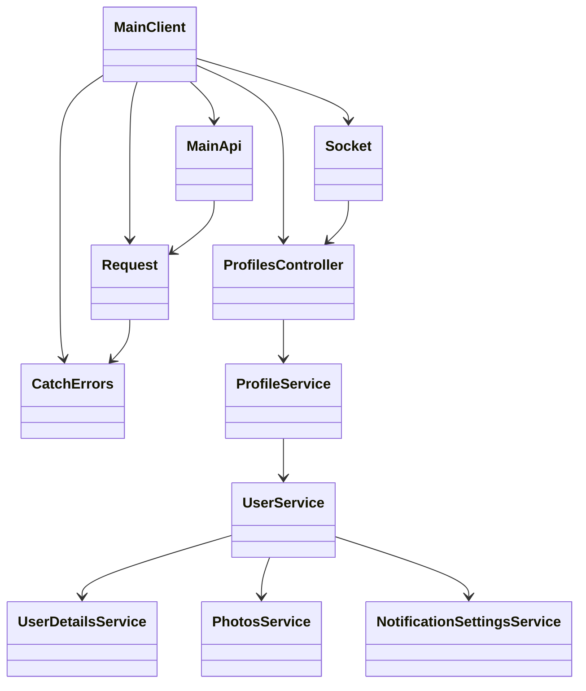
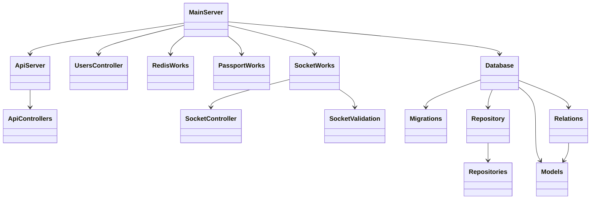

# My Messenger

Современный мессенджер с расширенными возможностями для общения и управления профилем.

## Технологический стек

### Frontend
- React + TypeScript
- Vite как сборщик
- Socket.IO для real-time коммуникации
- Zod для валидации событий сокет-соединения
- Axios для HTTP запросов
- Zustand для управления состоянием
- Material-UI для компонентов интерфейса
- React-testing-library, Jest + Vitest для тестирования
- Storybook для документации компонентов

### Backend
- Node.js + TypeScript
- Express.js как веб-фреймворк
- Sequelize ORM для работы с базой данных
- MS SQL Server как основная база данных
- Redis для кэширования и сессий
- Socket.IO для real-time функционала
- Zod для валидации событий сокет-соединения
- Multer для загрузки файлов
- Sharp для обработки изображений
- Winston для логирования

## Основные функции

### Профили пользователей
- Регистрация и авторизация
- Управление профилем
- Дополнительная информация о пользователе
- Настройки профиля
- Загрузка и управление фотографиями

### Мессенджер
- Real-time обмен сообщениями
- Статусы сообщений (отправлено, доставлено, прочитано)
- Загрузка медиафайлов
- Групповые чаты
- Поиск по сообщениям и контактам

## Архитектура приложения

### Иерархия классов

#### Архитектура Frontend


#### Архитектура Backend


### Описание основных компонентов

#### Frontend
- `MainClient` - Ядро бизнес-логики клиента, инициализирует и координирует работу всех компонентов
  - `MainApi` - HTTP клиент для работы с API, обрабатывает все запросы к серверу
  - `Request` - Базовый класс для HTTP запросов, обеспечивает единый интерфейс для работы с сетью
  - `ProfilesController` - Контроллер профилей пользователей, управляет данными профиля
    - `ProfileService` - Сервис для работы с основными данными профиля
      - `UserService` - Сервис для работы с данными пользователя
        - `UserDetailsService` - Сервис для работы с дополнительной информацией пользователя
        - `PhotosService` - Сервис для работы с фотографиями
        - `NotificationSettingsService` - Сервис для работы с настройками уведомлений
  - `Socket` - WebSocket клиент, обеспечивает real-time коммуникацию
  - `CatchErrors` - Централизованная обработка ошибок, обеспечивает единый механизм обработки ошибок

#### Backend
- `MainServer` - Ядро бизнес-логики сервера, инициализирует и координирует работу всех компонентов
  - `ApiServer` - API роуты и middleware, обрабатывает HTTP запросы
    - `ApiControllers` - Контроллеры API endpoints (Users, Profiles, Photos, Messages)
  - `UsersController` - Контроллер пользователей, управляет данными пользователей
  - `Database` - Работа с базой данных, обеспечивает доступ к данным
    - `Migrations` - Управление миграциями базы данных
    - `Repository` - Паттерн репозитория для работы с данными
    - `Repositories` - Конкретные реализации репозиториев
    - `Relations` - Управление связями между моделями
    - `Models` - Модели данных
  - `RedisWorks` - Работа с Redis, управляет кэшированием и сессиями
  - `PassportWorks` - Аутентификация и авторизация, обеспечивает безопасность
  - `SocketWorks` - WebSocket сервер, обеспечивает real-time коммуникацию
    - `SocketController` - Контроллеры WebSocket событий
    - `SocketValidation` - Валидация WebSocket событий (Message, EditMessage, ReadMessage)

### Обработка ошибок

#### Типы ошибок на бэкенде
- `BaseError` - Базовый класс для всех ошибок
- `MiddlewareError` - Ошибки middleware
- `RateLimiterError` - Ошибки ограничения запросов
- `PassportError` - Ошибки аутентификации и авторизации
- `DatabaseError` - Ошибки работы с базой данных
- `RepositoryError` - Ошибки репозитория
- `RedisError` - Ошибки работы с Redis
- `SocketError` - Ошибки WebSocket соединения

#### Ошибки API контроллеров
- `MainError` - Основная ошибка контроллеров
- `AuthError` - Ошибки аутентификации
- `ImagesError` - Ошибки при работе с изображениями
- `FilesError` - Ошибки при работе с файлами
- `FriendsError` - Ошибки при работе с друзьями
- `MessagesError` - Ошибки при работе с сообщениями
- `UsersError` - Ошибки при работе с пользователями

#### Обработка ошибок на фронтенде
- `CatchErrors.ts` - Централизованная обработка ошибок
- Отображение пользовательских сообщений об ошибках
- Логирование ошибок в консоль
- Автоматическое восстановление после ошибок

## Запуск приложения

### Локальный запуск

1. Клонируйте репозиторий:
```bash
git clone [repository-url]
cd my-messenger
```

2. Настройка переменных окружения:
   - Скопируйте `app/env_template` в `app/.env`
   - Скопируйте `server/env_template` в `server/.env`
   - Заполните необходимые переменные окружения (при старте в консоль будут выведены те переменные, которые оказались пропущенными)

3. Установка зависимостей:
```bash
# Установка зависимостей фронтенда
cd app
npm install

# Установка зависимостей бэкенда
cd ../server
npm install
```

4. Запуск в режиме разработки:
```bash
# Запуск бэкенда
cd server
npm run start

# Запуск фронтенда (в отдельном терминале)
cd app
npm run start
```

### Запуск через Docker

1. Убедитесь, что у вас установлен Docker и Docker Compose

2. Настройка переменных окружения:
   - Создайте файл `.env` в корневой директории на основе шаблонов
   - Настройте все необходимые переменные окружения (при старте в консоль будут выведены те переменные, которые оказались пропущенными)

3. Настройка секретов для базы данных:
   ```bash
   cd deploy
   echo -n 'your_secure_password' > sa_password.txt
   ```

4. Запуск через скрипт:
   ```bash
   # Перейдите в директорию deploy
   cd deploy
   
   # Запустите скрипт
   ./docker-compose-start.sh
   ```

   Скрипт проверит наличие необходимых файлов с секретами и запустит все сервисы через Docker Compose.

## Необходимые переменные окружения

### Frontend (.env)
- `VITE_BASE_URL` - базовый URL фронтенда
- `VITE_API_URL` - URL API бэкенда
- `VITE_SOCKET_URL` - URL для WebSocket соединения
- `VITE_COOKIE_NAME` - имя cookie для сессии
- `VITE_MAIL_FEEDBACK` - email для обратной связи

### Backend (.env)
- `PORT` - порт сервера
- `NODE_ENV` - окружение (development/production)
- `CLIENT_URL` - URL клиентского приложения
- `SECRET_KEY` - секретный ключ для сессий
- `DATABASE_*` - настройки подключения к базе данных
- `REDIS_*` - настройки Redis
- `SOCKET_*` - настройки WebSocket
- `MULTER_*` - настройки загрузки файлов
- `SHARP_*` - настройки обработки изображений

## Дополнительная информация

- База данных: MS SQL Server
- Кэширование: Redis
- Файловое хранилище: локальное (настраивается через переменные окружения)
- Логирование: Winston (файлы и консоль)
- Мониторинг: встроенные метрики и логи
